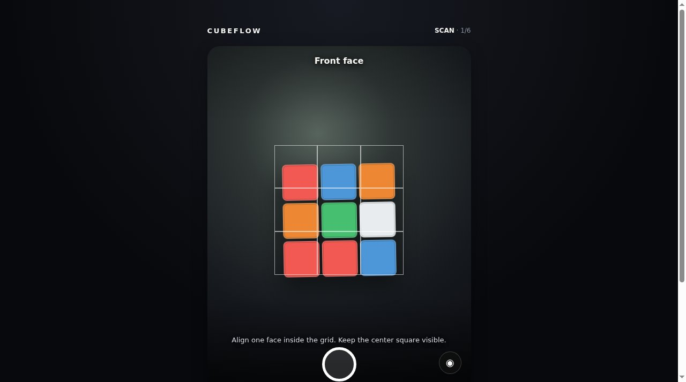

# CUBEFLOW

A camera cube coach. Scan a scrambled 3x3, then follow the solve one move at a time.



**Live:** https://aeiouvcode.github.io/cubeflow/

## About

1. **Scan** each of the six faces with your camera.
2. **Check** the colors and tap any square to fix it. The app verifies nine stickers of each color.
3. **Solve** with guided turns, one move at a time, grouped into stages like the white cross.

The solution is computed in the browser and replayed against the scanned state to prove it reaches a solved cube before coaching starts. No camera? Enter colors by tapping squares in the review step.

Camera frames never leave the device. Nothing is uploaded, and the scan is discarded when the tab closes.

## Run locally

```sh
git clone https://github.com/aeiouvcode/cubeflow.git
cd cubeflow
python3 -m http.server 8000
```

Then open http://localhost:8000.

Camera access requires `localhost` or HTTPS.

## Layout

```
index.html   interface, camera capture and coaching
cube.js      cube model and move logic
solve.js     solver
docs/        README assets
```
